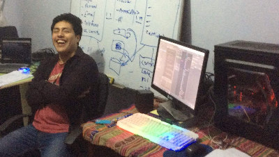
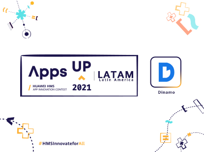
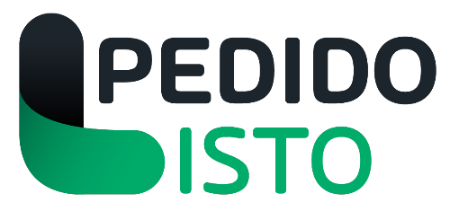

Nacido en Perú, Alvaro Enrique Diaz ha construido una notable carrera en el mundo de la tecnología y el software. Durante su juventud, incursionó en varias industrias hasta que encontró su verdadera pasión en el ámbito del software y las startups, llevándolo a comprometerse con esta fascinante carrera profesional.

# Su Viaje
Con solo 25 años, Alvaro ha obtenido una valiosa experiencia y conocimientos en ingeniería de software, trabajando en diversos proyectos internacionales. Su entusiasmo incesante por aprender y enfrentar nuevos desafíos se mantiene vivo y vibrante.

Lo que realmente lo motiva es la creación de soluciones tecnológicas que resuelven problemas reales y generan un impacto positivo en las vidas de las personas. Alvaro sigue comprometido con su crecimiento profesional y con la búsqueda de nuevas oportunidades para aportar a la comunidad tecnológica y emprender nuevos proyectos.

# Reconocimientos y Proyección
En su camino, Alvaro ha obtenido reconocimientos por su labor en el ámbito del software. Uno de sus logros es el proyecto "Dinamo", que recibió una mención honorífica en un concurso internacional de Huawei.

Aunque "Dinamo" está actualmente en pausa, Alvaro sigue adelante con su espíritu emprendedor, trabajando en un innovador proyecto llamado [Pedido Listo](www.pedidolisto.app).

# El Futuro
Mirando hacia el futuro, Alvaro permanece enfocado en su carrera como ingeniero de software. Su plan es seguir ampliando sus habilidades y su red de contactos en la industria, siempre manteniéndose receptivo a nuevas oportunidades. Tiene la visión de continuar contribuyendo al mundo tecnológico y formar parte de startups que mejoran la eficiencia de las personas y los negocios.

# Estudios y Vida Personal
Alvaro tuvo su primer acercamiento a la programación en el Colegio Técnico Experimental Jesús Obrero cuando llevo un curso CNC como parte de sus estudios de secundaria. Continuó su formación en Ingeniería de Software en la Universidad Tecnológica del Perú y se mantiene actualizado de manera autodidacta.

En su tiempo libre, disfruta de caminatas al aire libre, música, atardeceres, lectura y cine. Entre sus favoritos se encuentran el libro "Originales" de Adam Grant y la película "Pulp Fiction".

# Conéctate
Para seguir el viaje de Alvaro y estar al tanto de sus últimos proyectos y logros, no dudes en seguirlo en sus redes sociales y plataformas profesionales.

- [LinkedIn](https://linkedin.com/in/alvaroeds/)  
- [Twitter](https://twitter.com/alvaroeds) (su favorito)  
- [Instagram](https://instagram.com/alvaro.eds)
