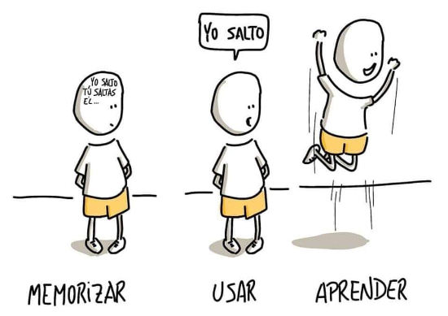
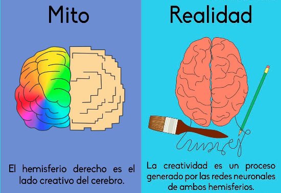
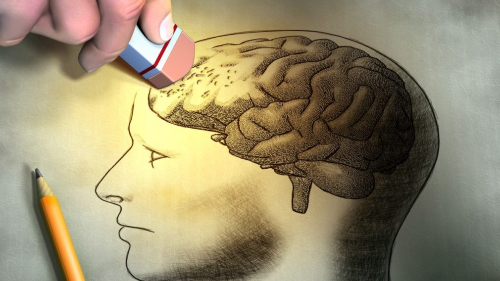
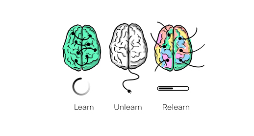

Aprendemos a darle prioridad a la rapidez con la que aprendemos, dejando a un lado el verdadero poder que tiene el aprender a aprender. Muchos piensan que aprender es un don innato y, si bien es cierto que todos tenemos nuestras fortalezas naturales, también es posible cultivar nuestras habilidades para aprender cualquier cosa que nos interese.

Rara vez nos instruyen sobre las diversas maneras de pensar y estudiar que podrían optimizar nuestro aprendizaje o sobre los límites cerebrales que podríamos aprovechar.

A veces suena a cliché, pero adoptar la "mentalidad de crecimiento", la creencia de que cualquier cosa puede lograrse con esfuerzo y tiempo, es fundamental. Pero, ¡ojo! En exceso puede ser perjudicial.

Dicho esto, si eres autodidacta, ¡felicidades! Probablemente ya estás familiarizado con tu propio ritmo de aprendizaje, pero estoy seguro de que encontrarás información valiosa en este blog que te ayudará a entender nuevos conceptos y a desmentir algunos mitos que aún se creen.

Empezamos.

## El cerebro y tipos de pensamiento

Todos poseemos el dispositivo más intrincado que la ciencia ha estudiado: nuestro cerebro. Un órgano que, pese a pesar solo 1.4kg, es el hogar de nuestros pensamientos, miedos, sueños y recuerdos.

A diferencia de la antigua creencia de que nuestra actividad cerebral era estática, se ha descubierto que constantemente se tejen nuevas conexiones, mientras se descartan otras, en un proceso de reinvención continua. En esencia, nos acostamos con un cerebro y nos levantamos con uno actualizado.

Se ha descubierto que el cerebro opera en dos modos de pensamiento:

- **Modo enfocado:** Usado para tareas intensas, como resolver problemas o comprender algo complicado.
- **Modo difuso:** Se activa al enfrentar problemas desconocidos. Ofrece una visión más amplia y creativa.

Aplicando el modo de pensamiento adecuado en el momento correcto, mejoramos nuestro aprendizaje. Pero, si es tan sencillo, ¿por qué no lo hacemos siempre? Aquí entran en escena los `neuromoduladores`.

Los neuromoduladores son químicos que influyen en la respuesta neuronal. Acetilcolina, dopamina y serotonina son tres de ellos.

- **Acetilcolina:** Las neuronas de acetilcolina guían nuestras neuronas para que formen conexiones para el aprendizaje enfocado y generen memorias a largo plazo.
- **Dopamina:** La Dopamina coordina el aprendizaje basado en recompensas, cambiando nuestras decisiones y conducta. Hoy sabemos que drogas y redes sociales pueden desequilibrar nuestro sistema de recompensas, llevando a la desmotivación.
- **Serotonina:** La Serotonina regula nuestra motivación y se asocia con el bienestar. Así, nuestra 'hormona de la felicidad' juega un papel crucial en cómo nos sentimos y cómo actuamos.

El cuidado de neuromoduladores mejora el aprendizaje. Incrementa la Acetilcolina con dieta rica en colina, potencia la Dopamina con actividades gratificantes saludables y alimentación equilibrada, evitando gratificaciones instantáneas que desbalancean este sistema, como el uso excesivo de redes sociales. Favorece la Serotonina con sol y positividad. Este cuidado facilita un aprendizaje efectivo, esencial para una vida de aprendizaje continuo.

## Cómo memorizamos y cómo hacerlo mejor

Nuestro cerebro es excelente para memorizar, pero debemos entender cómo hacerlo mejor. Aunque leer es útil, necesitamos experimentar para retener mejor la información. Distinguir entre memoria a largo plazo y memoria de trabajo es crucial.

La primera es donde almacenamos nuestros recuerdos más antiguos, mientras que la segunda es para procesar información inmediata. Para pasar un recuerdo de corto a largo plazo, necesitamos 'visitarlo' varias veces.

¿Y cómo podemos potenciar nuestra capacidad para memorizar? Podemos emplear técnicas como el palacio de memoria y la repetición espaciada.

- **Repetición espaciada:** Implica repasar la información a intervalos, permitiendo que las conexiones sinápticas se fortalezcan, dando así una base sólida a nuestros recuerdos.
- **Palacio de memoria:** Es una técnica que asocia información que queremos recordar con lugares conocidos. Esto sirve como una guía de memoria, facilitando el recuerdo.

> "La memoria es el tesoro y guardián de todas las cosas." - Marco Tulio Cicerón

## Para un mejor aprendizaje

Optimizar el aprendizaje implica considerar tanto los factores físicos como las técnicas que potencian el funcionamiento de nuestro cerebro. Abordaremos estos aspectos:

### Fragmentacion  
La fragmentación es vital para el pensamiento y acción, formando redes neuronales que conectan piezas de información. En vez de memorizar individualmente, es esencial entender cómo estos fragmentos se relacionan. Sin embargo, es fácil caer en el error de enfocarnos en los pasos individuales de problemas resueltos, olvidando su conexión entre ellos. En resumen, la construcción de fragmentos se optimiza con atención concentrada, comprensión de la idea central y práctica, favoreciendo el dominio del tema y la percepción del panorama general.

### El arte de no hacer nada (NIKSEN)
Las personas no somos máquinas, necesitamos saber pisar el freno y recargar nuestras energías. Este arte de "no hacer nada" puede parecer contraproducente si se trata de ser productivo, pero descansos sin estímulos reducen el estrés, promueven la introspección y aumentan la creatividad, mejorando nuestra claridad mental. Incluso puedes practicar "procrastinación productiva", vinculando estos espacios a tareas poco exigentes que puedes realizar en ese momento, quizá alguna actividad que te guste o algo nuevo que quieras experimentar.

Por último, recuerda abrazar el aburrimiento y no hacer nada de vez en cuando sin culpa alguna por no ser productivo.

### Técnicas

Aprender no es siempre un proceso lineal, a veces nos encontramos con obstáculos que pueden hacer que lo que antes tenía sentido de repente se vuelva confuso. Sin embargo, hay técnicas que pueden ayudarnos a superar estas dificultades:

- **Recordar:** Esta técnica es simple pero poderosa. Tras leer el material, haz una pausa, mira hacia otro lado y revisa qué puedes recordar. Este acto de recordar por sí mismo profundiza el aprendizaje y ayuda a comenzar la formación de fragmentos de conocimiento.
- **La Técnica Feynman:** La Técnica Feynman implica entender un concepto, explicarlo en términos sencillos, identificar áreas de confusión, estudiarlas más y finalmente, simplificar la explicación. Facilita la comprensión y comunicación eficaz de ideas complejas.

### Crear para aprender
Esta filosofía fomenta la aplicación y práctica de conocimientos, llevándote a una comprensión más rica. Cuando creas algo basado en lo aprendido, refuerzas la comprensión, perfeccionas habilidades y trabajas hacia la maestría del tema. Además, permite conectar distintas áreas de conocimiento en un contexto real, proporcionando una visión amplia del tema. La creación permite:
* Aplicación de Conocimientos
* Experiencia Práctica
* Maestría y Refinamientoudio
* Conexión y Contexto

### Aliméntate y Descansa
Cuidar tu cuerpo y mente es clave para un rendimiento óptimo. Una dieta rica en omega 3 y descanso adecuado benefician al cerebro. Además, mantener bajos niveles de estrés y ansiedad no solo te hará más feliz, sino que te permitirá pensar con claridad. Evitar el exceso de cortisol, hormona liberada en respuesta al estrés, ansiedad y miedo, es importante para evitar tensiones innecesarias y posibles daños al cuerpo.

## Destruyendo mitos

El proceso de encontrar respuestas es lo que verdaderamente ayuda a nuestro sentido de aprendizaje. En este camino, también es importante enfrentarnos a ciertos mitos.
- **El 10% del cerebro:** La idea de que solo utilizamos el 10% de nuestro cerebro. En realidad, todas las regiones del cerebro son utilizadas, aunque no de manera simultánea.
- **Estilos de aprendizaje rígidos:** Aunque es común creer que tenemos un único estilo de aprendizaje (visual, auditivo, etc.), en realidad, somos capaces de aprender de diversas formas y la adaptabilidad es clave.
- **Más estudio, más aprendizaje:** Contrario a la creencia popular, la calidad del estudio supera a la cantidad. La efectividad del aprendizaje radica en la concentración, comprensión y práctica, inclusive las pausas son necesarias para la consolidación del aprendizaje.
- **Los errores son malos:** En lugar de ser obstáculos, los errores son oportunidades para corregir comprensiones y mejorar habilidades, siendo partes integrales del proceso de aprendizaje.

> El desmantelamiento de estos mitos nos encamina hacia un enfoque de aprendizaje más saludable y efectivo.

## Desaprende

La idea de "desaprender para aprender", una frase intrigante que puede sonar contraintuitiva, subraya la necesidad de liberarnos de las limitantes de nuestras propias creencias y preconceptos para abrirnos a nuevas perspectivas.

Este proceso implica modificar nuestras creencias que limitan el aprendizaje, reconocer y contrarrestar nuestros sesgos cognitivos y fomentar la flexibilidad cognitiva para adaptarnos a nueva información.

En esencia, "desaprender para aprender" es concebir el aprendizaje como un camino evolutivo, donde deshacernos de ideas obsoletas posibilita la adquisición de nuevos modos de pensar y aprender

## Conclusión

El aprendizaje es un proceso fascinante y multifacético que puede ser optimizado a través del entendimiento de nuestra propia mente, la adopción de técnicas efectivas y la disposición para deshacernos de mitos anticuados. Cada persona tiene la capacidad de aprender, de remodelar su cerebro y de ampliar su conocimiento tanto como esté dispuesta a hacerlo. Lo crucial es entender que no se trata únicamente de qué o cuánto aprendemos, sino de cómo lo hacemos.

Nuestra capacidad para aprender es una herramienta poderosa. Independientemente de la edad, la profesión o las habilidades previas, aprender a aprender nos desvela un universo de posibilidades y conocimientos. Nuestro cerebro, aunque complejo, es también adaptable y, con la dirección correcta y la actitud adecuada, puede ser moldeado para convertirse en un eficaz instrumento de aprendizaje y crecimiento.

Debemos tener presente que el aprendizaje efectivo no es un don innato, sino una habilidad que puede ser desarrollada. Constituye un viaje de autodescubrimiento, experimentación y mejora continua. Así que, independientemente de dónde te encuentres en tu trayectoria de aprendizaje, siempre hay maneras de avanzar y siempre queda más por explorar.

A lo largo de este blog, hemos explorado numerosos aspectos del aprendizaje, desde la forma en que funciona nuestro cerebro, los procesos de memorización, técnicas para potenciar nuestro aprendizaje, hasta la relevancia de una adecuada alimentación y descanso. Mi deseo es que esta información te ayude a perfeccionar tus habilidades de aprendizaje y te motive a seguir investigando y descubriendo.

Como bien decía Benjamin Franklin: "Dime y lo olvido, enséñame y lo recuerdo, involúcrame y lo aprendo". Sigue aprendiendo, sigue creciendo y nunca dejes de maravillarte por las increíbles posibilidades de tu mente.

